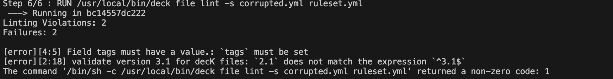

# Kong Business Rules Lint

## Descrição
Este projeto é responsável por realizar a verificação e validação das regras de negócio do Kong.

## Funcionalidades
- Verificação de regras de negócio do Kong
- Validação de sintaxe e semântica das regras
- Geração de relatórios de erros e avisos

## Instalação
1. Clone o repositório: `git clone https://github.com/seu-usuario/kong-business-rules-lint.git`
2. Acesse o diretório do projeto: `cd kong-business-rules-lint`
3. Execute o build da imagem: `docker build .`

## Uso
1. Adicione as regras de negócio do Kong no arquivo `rulesset.yml`
2. Execute o lint: `docker build .`
3. Verifique os relatórios de erros e avisos gerados no `terminal`

## Contribuição
Contribuições são bem-vindas! Sinta-se à vontade para abrir uma issue ou enviar um pull request.

## Licença
Este projeto está licenciado sob a [MIT License](LICENSE).